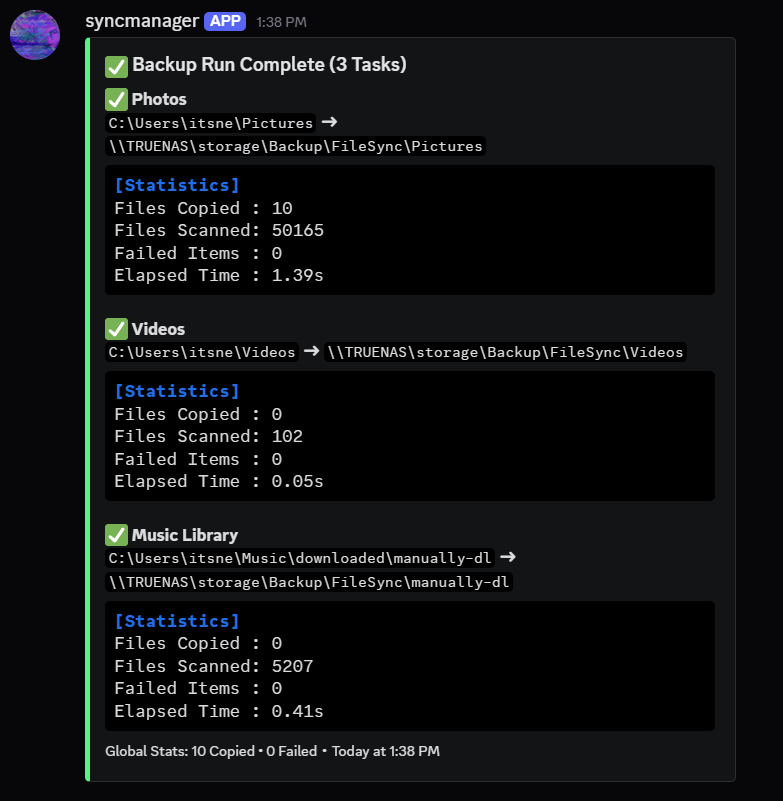
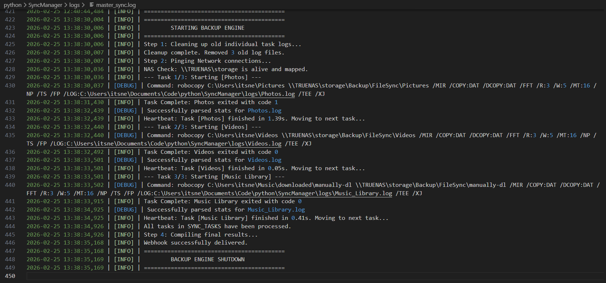

# Robo-Sync-Manager 🤖🔄

A robust, multi-threaded Windows automated backup tool. It leverages `robocopy` to mirror directories (to NAS or local drives) and sends beautifully formatted logs and summaries directly to a Discord channel via Webhooks.

| ✅ Automated Discord Report | 🛠️ Behind the Scenes (Execution Logs) | 
| :--- | :--- |
|  |  | 

## 🌟 Features
- ⚡ **Robocopy Mirroring**: Fast, multi-threaded copying that only transfers changed files. Perfect for massive directories.
- 💬 **Discord Integration (Optional)**: Automatically parses `robocopy`'s tricky UTF-16 log files to extract total files scanned, copied, skipped, and failed, delivering a clean summary to your server.
- 🔌 **Pre-flight NAS Checks**: Automatically wakes up/pings network drives (e.g., `\\NAS\share`) before executing to ensure Windows has mounted them, preventing false failure alerts.
- 👻 **Windowless Execution Support**: Safely handles encoding outputs for silent background processing (e.g., running via `pythonw.exe` in Task Scheduler without flashing console windows).

---

## 🛠️ Prerequisites
- **Windows OS** (Relies natively on `robocopy.exe`).
- **Python 3.8+**

---

## 🚀 Setup & Installation

**1. Clone the repo:**
```bash
git clone git@github.com:NickWinston123/Robo-Sync-Manager.git
cd Robo-Sync-Manager
```

**2. Install requirements:**
```bash
pip install -r requirements.txt
```

**3. Configure Backup Tasks:**
Copy `config.json.example` to `config.json`. Define your source paths, destination paths, and thread counts. 
*(Note: Remember to double-escape backslashes in JSON).*

You can run tasks in standard mirror mode or rolling snapshot mode:

```json
{
    "tasks": [
        {
            "name": "Main Documents (Mirror)",
            "source": "C:\\Users\\Username\\Documents",
            "destination": "\\\\NAS\\share\\Backups\\Documents",
            "threads": 8,
            "mode": "direct"
        },
        {
            "name": "Project Files (7-Day History)",
            "source": "C:\\Work\\Projects",
            "destination": "\\\\NAS\\share\\Backups\\Projects_History",
            "threads": 8,
            "mode": "history",
            "days": 7
        }
    ]
}
```

**Task Parameters:**
*   `mode`: Use `"direct"` (Default) to exactly mirror and overwrite the destination folder. Use `"history"` to automatically create a new `YYYY-MM-DD` folder inside the destination every day.
*   `days`: *(Only used if mode is "history")*. The number of daily backups to keep before the script automatically deletes the oldest ones.

**4. Configure Discord Webhook (Optional):**
If you want Discord notifications, copy `.env.example` to `.env` and add your webhook URL:
```env
DISCORD_WEBHOOK_URL="https://discord.com/api/webhooks/YOUR_WEBHOOK_HERE"
```

---

## 📖 Usage

### Manual Execution
To run the script interactively and watch the console output:
```bash
python SyncManager.py
```

### Automating with Windows Task Scheduler (Recommended)
This script is designed to run silently in the background on a schedule. To set it up:
1. Open **Task Scheduler** -> **Create Task...**
2. **General**: Check *"Run whether user is logged on or not"* (Highly recommended if backing up to a NAS).
3. **Triggers**: Set your schedule (e.g., Daily at 2:00 AM).
4. **Actions**:
   - Action: `Start a program`
   - Program/script: `pythonw` *(Using `pythonw` instead of `python` prevents a black console window from popping up).*
   - Add arguments: `SyncManager.py`
   - Start in: `C:\Path\To\Your\Robo-Sync-Manager`

---

## ⚙️ How it works under the hood
1. **Reads Configuration:** Scans `config.json` for all sync configurations.
2. **Pre-flight Checks:** Pings destination root paths to ensure Windows has initialized the network shares.
3. **Execution:** Spawns `robocopy` subprocesses sequentially, generating discrete log files inside the `/logs/` directory.
4. **Data Extraction:** Uses Regex to drill into the raw log files to retrieve exact statistical data.
5. **Notification:** Bundles the statistics and delivers a single, color-coded embed notification to Discord detailing the success or failure of the run.

---

## 📄 License
MIT